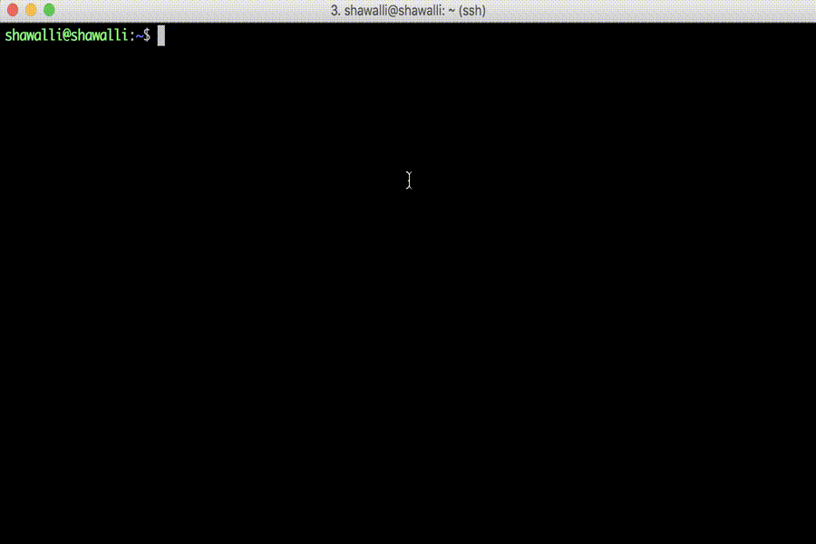

# Shython
Shython extends the default Python intereter (available via the 'code' module) to add some extra features, as described below.

## Buffers
An annoyance I've always had with the interpreter is building out classes and methods. They are generally entered one line at a time. Once the class/method is complete, the
interpreter compiles the code and throws an error if one exists. At that point, the user has multiple options, three of which are included below. The user can either manually re-type everything. Annoying. The user can perform a combination of up-arrows and enters a bunch of times to re-build the class/method. Annoying. A user can use a separate file as a scratch pad to build out the class/method, and copy-paste the code block into the interpreter each time it changes (while removing any extra spaces that would trip up the interpreter). Also annoying.

Shython seeks to remedy this problem using a concept known hereafter as buffers. A user can manage the creation and deletion of buffers, edit the buffer using an editor (currently only Vim), and execute the buffers, all within the interpreter. Additionally, these buffers are treated and run as files, as opposed to individually executed lines of code on the interpreter. As such, you may use empty lines wherever you please.

Buffers are backed by files, so that they persist between sessions. As such, it is possible to handle buffers in a variety of ways. For instance, a buffer can be edited by an external editor and re-executed during a session. A buffer can be version controlled. A buffer from a previous session can be re-opened by Shython by passing the buffer's path to the 'badd' command.

Anything run in a buffer is scoped globally, meaning that classes, methods, and variables created in the buffer will persist in the interpreter after the buffer can been executed. For example, if you create a class 'Foo' in a buffer and run it, you can create an instance of foo from the interpreter command line.

### Buffer Commands
Shython commands are detected by the interpreter when an interpreter line starts with a colon. A table describing the current Shython commands is included below.

| Command | Arguments                 | Description |
|:-------:|:------------------------- |:----------- |
| help    | [COMMAND]                 | Print this message and exit. If a command is provided, that command's help message is printed instead. |
| badd    | [PATH ...]                | Add a buffer. If a path is provided, open a buffer backed by that file instead of a new file. |
| bdel    | &lt;BUFFER_NUM&gt; [...]  | Delete a buffer as referenced by its buffer number. One or more buffer numbers must be provided. |
| bed     | &lt;BUFFER_NUM&gt; [...]  | Edit a buffer as referenced by its buffer number. One or more buffer numbers must be provided. |
| binit   | [PATH]                    | Re-initialize the buffer list. If a path is provided, it is used as the root directory instead of the current directory. |
| bls     |                           | List all buffers. |
| brun    | &lt;BUFFER_NUM&gt; [...]  | Execute a buffer as referenced by its buffer number. One or more buffer numbers must be provided.After executing the buffer, any classes, method, or variables created by the buffer will be available to the interpreter. NOTE: Buffers execute in the interpreter global scope. A reference will be clobbered if an object of the same name is changed in the buffer. |

### Buffer Demo
The demo below shows a common workflow example in Shython.
1. Shython is invoked.
2. A buffer is added. A listing of the buffer is shown for demonstration.
3. The buffer is edited. A class is created, with free usage of empty lines.
4. The buffer is executed.
5. The class and variable that were created when the buffer ran are now available to the interpreter.

## History
Commands are saved in a history file (.shython_history) in the directory from which Shython was run. As a result, an interpreter session can remember code executed in previous sessions.
